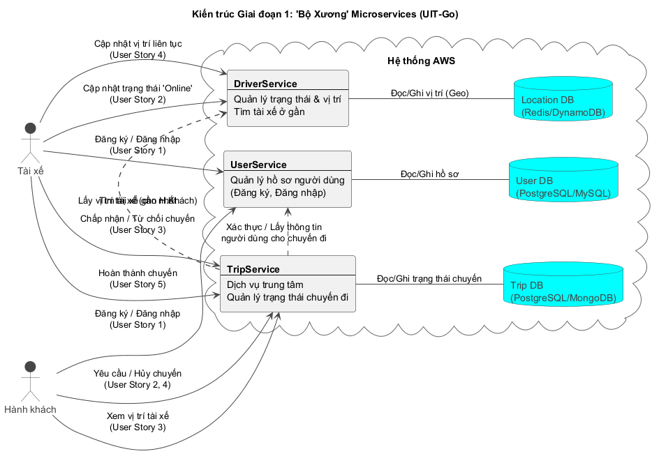
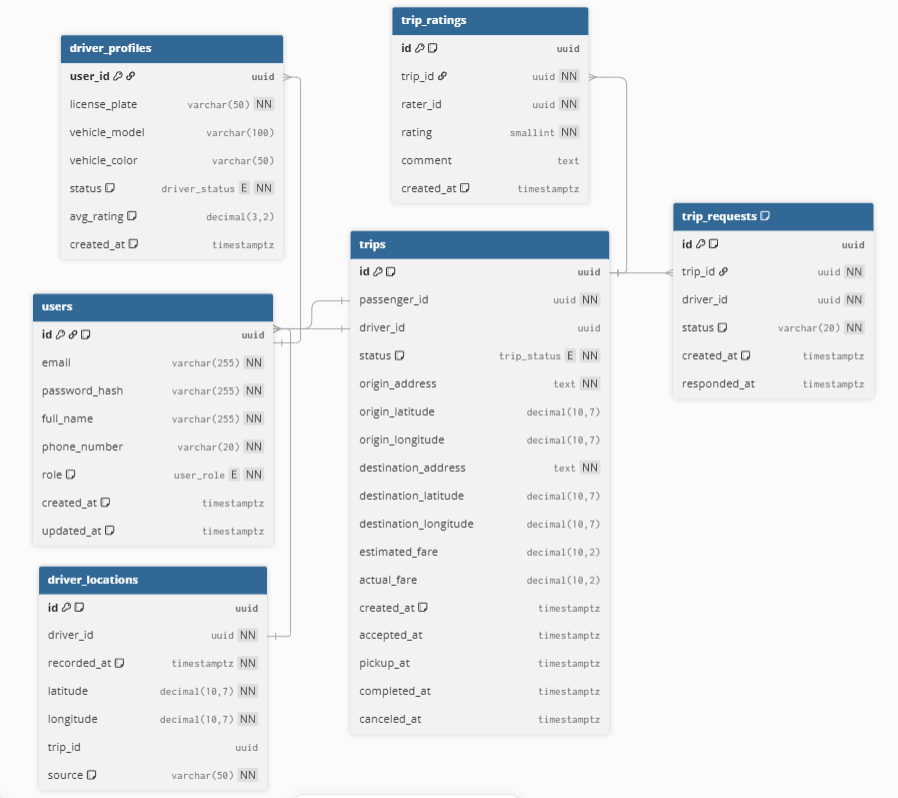
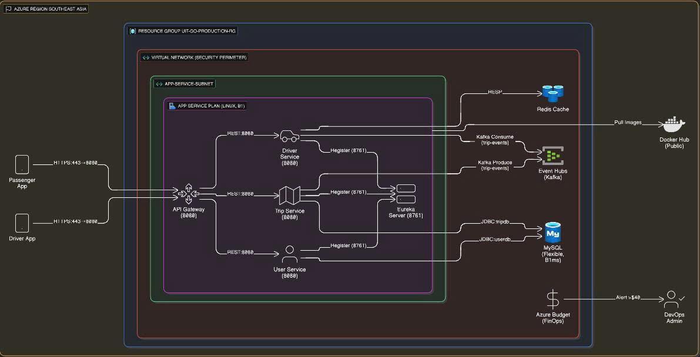

# Tài liệu Kiến trúc Hệ thống UIT-Go

## 1. Sơ đồ Kiến trúc Tổng quan

Đây là kiến trúc "Bộ Xương" Microservices (Giai đoạn 1) của hệ thống.

### Mô tả các Services

1.  **UserService**:
    * **Trách nhiệm:** Quản lý thông tin người dùng (hành khách, tài xế), đăng ký, đăng nhập.
    * **Cơ sở dữ liệu:** MySQL
2.  **TripService**:
    * **Trách nhiệm:** Xử lý logic tạo và quản lý trạng thái chuyến đi.
    * **Cơ sở dữ liệu:** MySQL.
3.  **DriverService**:
    * **Trách nhiệm:** Quản lý trạng thái, vị trí tài xế và tìm kiếm tài xế ở gần.
    * **Cơ sở dữ liệu:** Redis (ElastiCache).

## 2. Sơ đồ Kiến trúc Module Chuyên sâu

**Tên Module:** Thiết kế cho Automation & Cost Optimization (FinOps) (Module E)

### Giải thích thiết kế Module

1.  **Azure App Service** thay cho **Kubernetes**
    * Độ khó triển khai ban đầu: Azure App Service có độ khó thấp hơn so với Kubernetes
    * Chi phí hạ tầng: Azure App Service có chi phí hạ tầng thấp hơn so với Kubernetes (10$-15$/tháng so với 70$-100$/tháng cho 3 node)
2.  **Azure Event Hubs** thay cho **VM with Kafka**
    * Độ khó triển khai ban đầu: Azure Event Hubs có độ khó thấp hơn so với triển khai VM với Kafka
    * Chi phí hạ tầng: Việc triển khai VM với Kafka tiêu tốn chi phí cao hơn so với việc dùng Azure Event Hubs (Azure Event Hub tốn 30$-40$/tháng trong khi triển khai với Kafka có thể tốn 130$-140$/tháng cho 3   node trên cùng 1 VM)
3.  **Docker Hub** thay cho **Azure ACR**
    * Chi phí hạ tầng: Docker Hub hoàn toàn free trong khi Azure ACR sẽ có chi phí định kỳ --> không phù hợp với mục tiêu tối ưu hóa chi phí của module E
    * Khả năng tích hợp CI/CD: Docker Hub dễ dàng và nhanh chóng hơn so với Azure ACR (cần nhiều cấu hình)
